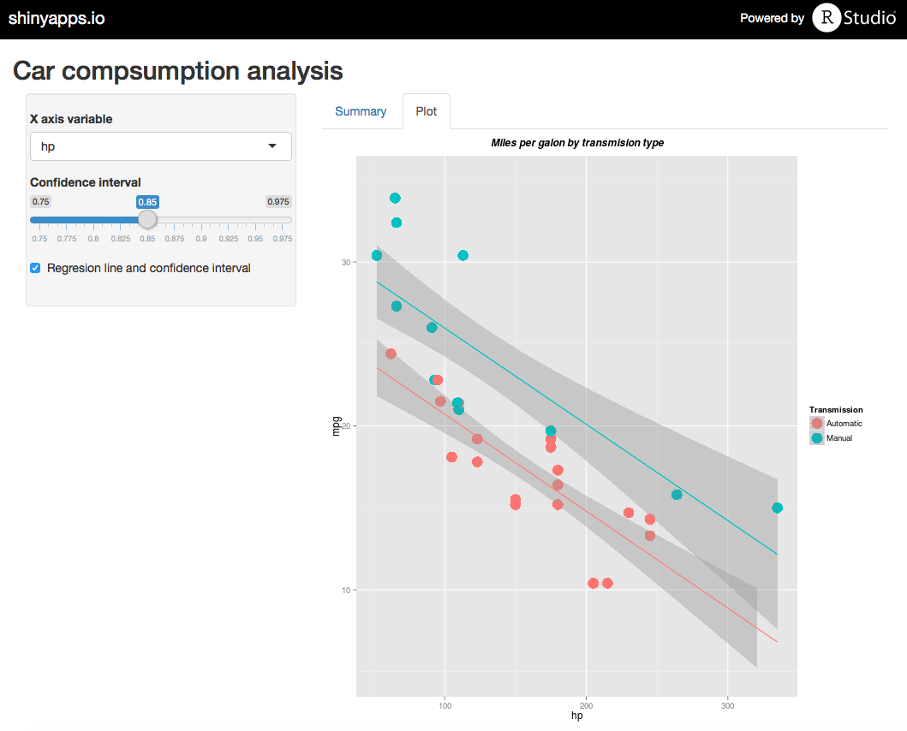
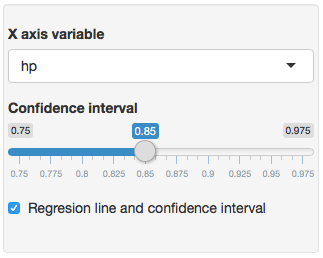

## Exploratory analysis tool on mtcars dataset

This shiny app allows to conduct an exploratory analysis over a dataset of cars to explore the relationship between car’s transmission and miles per gallon (mpg) taking into consideration the potential influence of other variables

<div style='text-align: center;'>
    
</div>

--- .class #id 

## How to use it (options)

**The sidebar panel** allows to chose:
- The x axis variable you want to plot against the mpg (miles per galon)
- Include the linear regresion on the plot ("Regresions line and confidence interval" checkbox)
- If *Regesion line and confidence interval* checkbox is selected, the you can determine the confidence interval (70% to 97.5%) you want to show on the plot

<div style='text-align: center;'>
    
</div>

---

## How it looks like (plot tab)

- The Y axis represent "miles per galon"". X axis variable can be chosen on the sidebar menu
- Points in red represent automatic transmision cars. Blue points represent manual cars
- Particular implementation: mph vs hp, without confidence interval (R code to generate this plot can be seen on the .Rmd file included on the Github directory)

```{r plot1, fig.height=6, fig.align='center',echo=FALSE, message=FALSE}
require(ggplot2)
data<-mtcars
data$am<-factor(mtcars$am)      

p<-ggplot(data,aes_string(x="hp",y="mpg",color="am")) + 
            geom_point(size=6) +
            labs(title="Miles per galon by transmision type")+
            scale_y_continuous(limits=c(5, 35))+
            theme(plot.title=element_text(vjust=1.5,face="bold.italic",size=12),strip.text=element_text(size=12))+
            scale_color_discrete(name="Transmission",breaks=c(0,1),labels=c("Automatic", "Manual"))

p


```


---

## How it looks like (plot tab)

- Regresion line is red for automatic cars and blue for manual ones
- Confidence interval is shown by a grey shadow
- Particular implementation: mph vs hp, with a confidence interval of 95% (R code to generate this plot can be seen on the .Rmd file included on the Github directory)

```{r plot2, fig.height=6, fig.align='center',echo=FALSE, message=FALSE}
require(ggplot2)
data<-mtcars
data$am<-factor(mtcars$am)      

p<-ggplot(data,aes_string(x="hp",y="mpg",color="am")) + 
            geom_point(size=6) +
            labs(title="Miles per galon by transmision type")+
            scale_y_continuous(limits=c(5, 35))+
            theme(plot.title=element_text(vjust=1.5,face="bold.italic",size=12),strip.text=element_text(size=12))+
            scale_color_discrete(name="Transmission",breaks=c(0,1),labels=c("Automatic", "Manual"))
p <- p + stat_smooth(method="lm",level=0.95,fullrange=TRUE)

p


```

