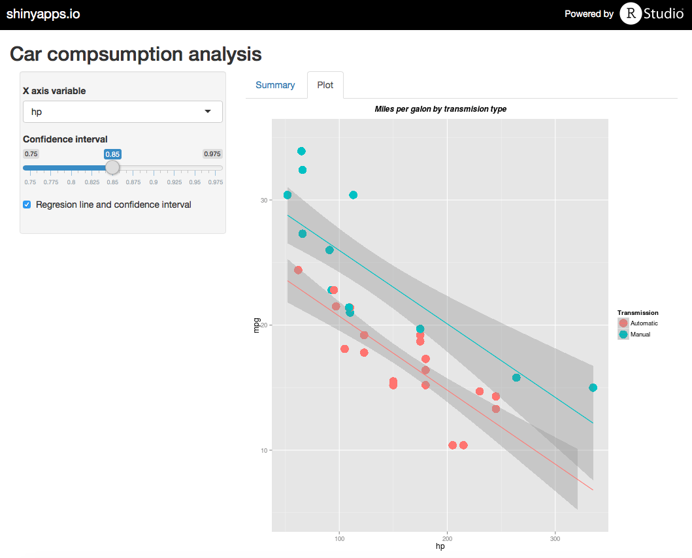
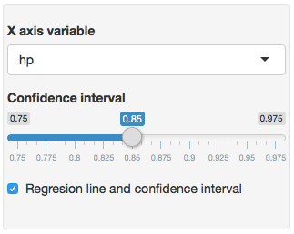
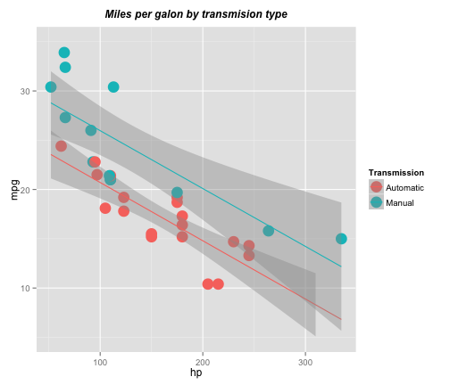

## Exploratory analysis tool on mtcars dataset

This shiny app allows to conduct an exploratory analysis over a dataset of cars to explore the relationship between car’s transmission and miles per gallon (mpg) taking into consideration the potential influence of other variables

    

--- .class #id 

## How to use it (options)

**The sidebar panel** allows to chose:
- The x axis variable you want to plot against the mpg (miles per galon)
- Include the linear regresion on the plot ("Regresions line and confidence interval" checkbox)
- If *Regesion line and confidence interval* checkbox is selected, the you can determine the confidence interval (70% to 97.5%) you want to show on the plot

    

---

## How it looks like (plot tab)

- The Y axis represent "miles per galon"". X axis variable can be chosen on the sidebar menu
- Points in red represent automatic transmision cars. Blue points represent manual cars
- Particular implementation: mph vs hp, without confidence interval (R code to generate this plot can be seen on the .Rmd file included on the Github directory)

---

## How it looks like (plot tab)

- Regresion line is red for automatic cars and blue for manual ones
- Confidence interval is shown by a grey shadow
- Particular implementation: mph vs hp, with a confidence interval of 95% (R code to generate this plot can be seen on the .Rmd file included on the Github directory)

